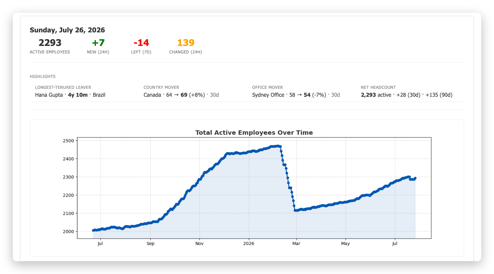
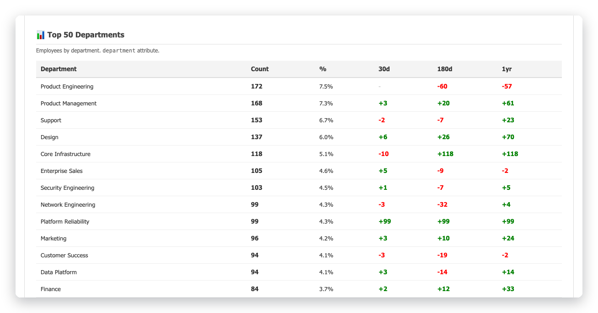

# LDAP Time Machine

Snapshot an LDAP directory every night into SQLite, work out what changed, and
email a report about it.

Directories tell you what is true *now*. They do not tell you that four people
moved into Security last week, that a contractor's account has been dormant
since March, or when exactly someone joined. LDAP Time Machine keeps the
history so you can answer those questions, and mails a daily summary so you
notice the answers without going looking.

Works with **Active Directory**, **OpenLDAP**, and any RFC 4519 directory.



## The daily email

Summary metrics and a headcount trend graph, then joiners, leavers with tenure,
a section per tracked attribute (title, department, manager, location) showing
old → new, ranked breakdowns by country / office / department / title with
30-day, 180-day and 1-year deltas, and the longest-tenured list.

Two details that matter once a directory gets big:

Every breakdown carries 30-day, 180-day and 1-year deltas, which is where a
year of stored history starts paying for itself. Each delta compares today's
count with the snapshot from that long ago — it is not a tally of changes
made during the window. Below, `Platform Reliability` is `+99` in all three
columns because it did not exist until this morning's reorganisation: against
every past date, it is up by its whole headcount. `Core Infrastructure` reads
`-10 / +118 / +118` — now 118 people, 128 a month ago, none six months ago:
created by a reorganisation, and quietly shrinking since. Neither is visible
in a directory that only knows about today.



Reorganisations roll up, so a department rename that moves a hundred people is
one row rather than a hundred, and the handful of genuine individual moves that
day are still visible. People who share a display name are highlighted and
badged with their username, so you are never quietly reading about the wrong
person.

Every report is also archived to `email_archive/`, so you can read it without a
mail client — and diff two of them. And because the history is all in the
database, `ldap-time-machine --replay 2026-03-14` re-renders the report any
past run date produced — tenure, windows and trend as of that day — months
after the original email is gone.

<sub>Screenshots show synthetic data — a simulated 2,300-person directory with
400 days of daily history, generated for testing. No real directory is
depicted.</sub>

## Requirements

- Python 3.9+
- `ldapsearch` — `apt install ldap-utils` / `dnf install openldap-clients` /
  preinstalled on macOS
- A read-only directory service account
- An SMTP relay (optional — the report is archived either way)

## Quick start

```bash
git clone https://github.com/jbrooks84/ldap_time_machine.git
cd ldap_time_machine
python3 -m venv .venv
.venv/bin/pip install -e .
```

Credentials, kept out of the repository:

```bash
mkdir -p ~/.config/ldap-time-machine
cp credentials.example.yml ~/.config/ldap-time-machine/credentials.yml
chmod 600 ~/.config/ldap-time-machine/credentials.yml
```

Edit it — bind DN/UPN, password, and where to send the report. Use a dedicated
service account, not a person's: a personal account ties the job to someone's
employment and to their password rotation, and both eventually end the job
without warning.

Directory settings:

```bash
cp config.example.yml config.yml
```

At minimum:

```yaml
ldap:
  flavor: active_directory      # or openldap, or generic
  server: ldaps://dc01.example.com
  base_dn: DC=example,DC=com
```

Then check it works:

```bash
.venv/bin/python ldap_time_machine.py --dry-run
```

A dry run does everything a real run does — including the actual directory
query — except that it writes to a throwaway copy of the database and sends no
mail. The rendered report lands in `email_archive/dryrun_<timestamp>.html`;
open it in a browser. Run this before letting any change reach the schedule.

When it looks right:

```bash
.venv/bin/python ldap_time_machine.py
```

Then [schedule it](docs/operations.md#scheduling).

## Documentation

| | |
|---|---|
| [Configuration](docs/configuration.md) | Attribute roles, directory flavors, narrowing the population, tuning the noise controls |
| [Operations](docs/operations.md) | Scheduling, monitoring, troubleshooting, backups, maintenance |
| [Architecture](docs/architecture.md) | How a run works, the database schema, querying it directly, design decisions |
| [Tools](tools/README.md) | Standalone lookup and exploration utilities |
| [Contributing](CONTRIBUTING.md) | Development setup and what the project cares about |
| [Changelog](CHANGELOG.md) | What changed in each release |

`config.example.yml` documents every setting inline.

The defaults assume a large, busy, imperfect directory — a 7-day leaver
confirmation, 14-day flap suppression, a 90% result-count guardrail. On a small
or well-curated one they are too conservative; see
[tuning](docs/configuration.md#tuning-for-your-directory) for what each absorbs
and how to turn it off.

## License

Apache License 2.0 — see [LICENSE](LICENSE).
